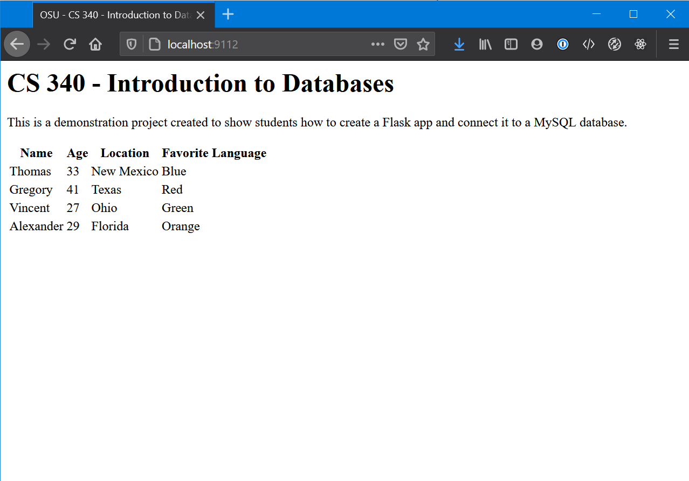
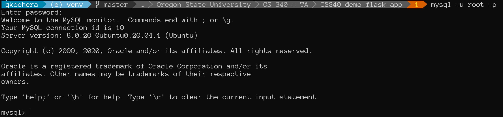
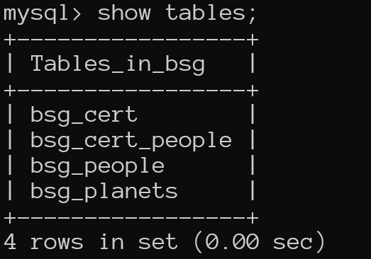
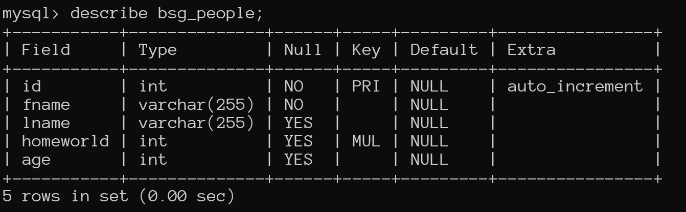
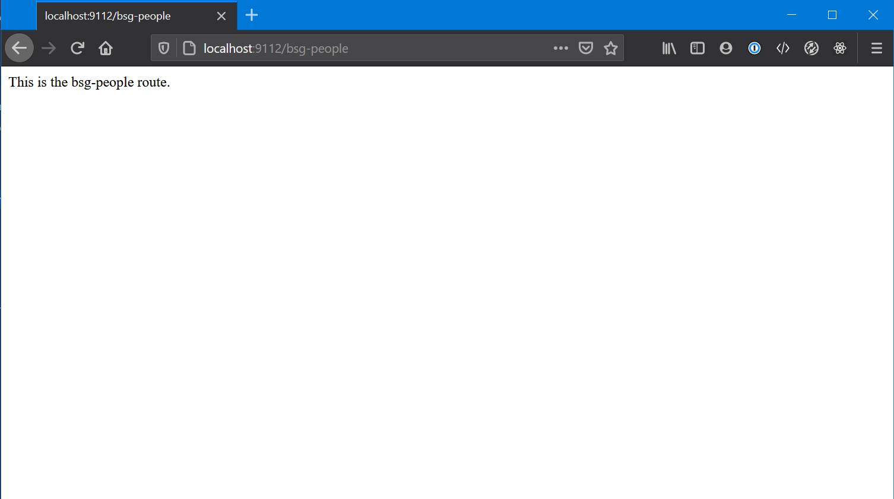
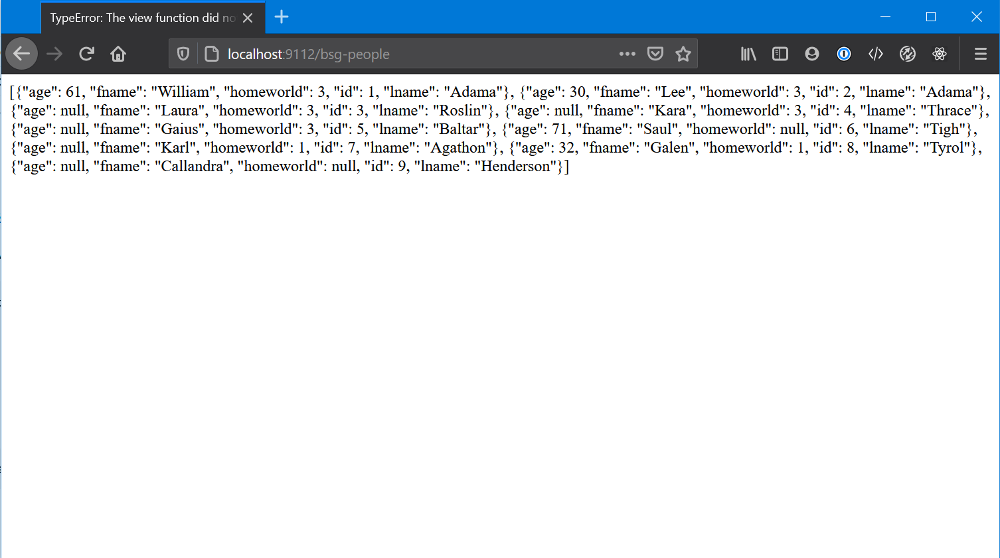
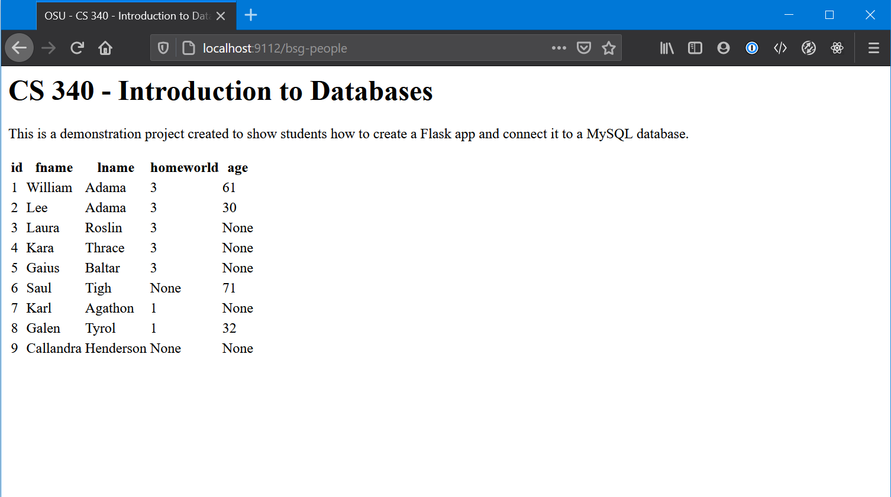
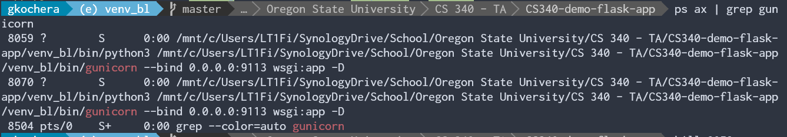

# Overview

This guide is intended for the students in CS 340 who want to take a path through the class using Flask/Python instead of Node.js.

This guide walks through everything from getting the tools setup to work on the app, setting up the infrastructure required to build and run your app, and building and (eventually) deploying the app either to OSU's flip server or Heroku.

There are a few assumptions that are made when this guide is written:

- You have basic familiarity with Python and MySQL syntax
- You are capable of opening a terminal and navigating using basic commands like `cd`, `ls`, etc.
    - I will present the Windows command prompt equivalents however I strongly recommend getting a proper terminal installed. Life will be way easier; I promise!
- You are developing your project on your own machine and not directly on the OSU server
    - We will point out differences for those who are working on the OSU server or any steps you might need to take
- This guide was developed using Windows 10 coupled with Windows Subsystem for Linux 2 (running Ubuntu). I will point out any variations where commands or tasks are different for users with other setups.


## Contributions

This guide is based off of the work previously done by prior TA and student, @mlapresta. Her previous work can be found in the repo [mlapresta/cs340_starter_app](https://github.com/mlapresta/cs340_starter_app). Without this work, this would have been a larger endeavor. In particular, we use her `db_connector.py` and `db_credentials.py` as well as some of her documentation.

Dr. Curry and Prof. Safonte for allowing me the time to build the guide and project for other students to benefit from.

# Table of Contents

- [Overview](#overview)
  - [Contributions](#contributions)
- [Table of Contents](#table-of-contents)
- [Setup](#setup)
- [Step 1 - Get The Tools Downloaded You Will Need](#step-1---get-the-tools-downloaded-you-will-need)
  - [Text Editior](#text-editior)
  - [Database Engine](#database-engine)
  - [Python](#python)
  - [Browser](#browser)
  - [Terminal Application](#terminal-application)
- [Step 2 - Preparation](#step-2---preparation)
  - [Git](#git)
  - [Create a .gitignore File](#create-a-gitignore-file)
  - [Python Virtual Environment (Optional but Recommended)](#python-virtual-environment-optional-but-recommended)
  - [Install Flask and its Dependencies](#install-flask-and-its-dependencies)
  - [Project Directory Structure](#project-directory-structure)
- [Step 3 - Building `app.py`](#step-3---building-apppy)
  - [Starting `app.py`](#starting-apppy)
- [Step 4 - Templates](#step-4---templates)
  - [Setting up Templating in Flask](#setting-up-templating-in-flask)
  - [Dynamically Displaying Data in a Template](#dynamically-displaying-data-in-a-template)
- [Step 5 - Connecting the Database](#step-5---connecting-the-database)
  - [Starting the Database](#starting-the-database)
  - [Accessing the Database](#accessing-the-database)
  - [Populating the Database](#populating-the-database)
  - [Connecting the Database to Our App](#connecting-the-database-to-our-app)
- [Step 6 - Adding Queries to Your App and Displaying Data](#step-6---adding-queries-to-your-app-and-displaying-data)
  - [Running a Query](#running-a-query)
- [Conclusion](#conclusion)
- [Extra Bits](#extra-bits)
  - [Gunicorn](#gunicorn)
  - [Migrating a Project Developed Locally to OSU for Deployment](#migrating-a-project-developed-locally-to-osu-for-deployment)
  - [Better Ways to Store Database Credentials](#better-ways-to-store-database-credentials)
  - [Deploying your Webapp to Heroku](#deploying-your-webapp-to-heroku)

# Setup

Preparation is key with any project, especially a portfolio project. You want to show prospective employers that you can not only be productive but also work efficiently. Preparation will also make your project flow smoothly as well as let you pinpoint the area where bugs are occuring with ease. Read on, and we will go throug a step-by-step guide on getting setup to run your first Flask project.

<a name="step-1"></a>
# Step 1 - Get The Tools Downloaded You Will Need

You are going to need a few things get going here.

<a name="text-editor"></a>
## Text Editior

Text Editors are like clothes. Everyone has their preferences. I prefer VS Code so this guide will be built using that editor. You can use what you please. Atom, Sublime, Notepad, Vim, eMacs or even Notepad are completely acceptable. We just need to be able to edit our code.

<a name="database-engine"></a>
## Database Engine

**MySQL** is the database we will be using in this class. MariaDB and PostgresSQL are other flavors of database engines, but for the purposes of this guide and class, we're going to stick with MySQL. It's acceptable to use MariaDB and PostgresSQL as they are relational databases but just be aware support may be limited from staff and your peers.

[Here](https://dev.mysql.com/downloads/mysql/) is a link to download MySQL Community Edition. Pick the correct operating system you are on, and follow the prompts. It will ask you to login or signup, just skim to the bottom and click "No thanks, just start my download."

MacOS and *nix users can also find their installations here. In case you get lost though here are some resources for installing MySQL on the common OSes.

Mac OSX: https://www.thoughtco.com/installing-mysql-on-mac-2693866

Ubuntu 20.04: https://www.digitalocean.com/community/tutorials/how-to-install-mysql-on-ubuntu-20-04

Ubuntu 18.04: https://www.digitalocean.com/community/tutorials/how-to-install-mysql-on-ubuntu-18-04

Mint 20.04: https://medium.com/@shivraj.jadhav82/mysql-setup-on-linux-mint-948470115d5

> When setting up your MySQL installation, please make note of what you set the root password to. We will need this later. Keep it safe.

<a name="python"></a>
## Python

Python is the language we will be using to build our Flask application. You can find the downloads for that here.

https://www.python.org/downloads/

I won't get to specific here, at this point in the program, you should be familiar with how to install Python (or already have it installed). We will require Python 3 (or better) for the purposes of this project.

<a name="browser"></a>
## Browser

Personally, I am a Firefox user. This guide will be using Firefox, but Chrome is also acceptable. I'm not familiar with Edge, but if you are, you can certainly give it a whirl also. Just be familiar with opening your developer console. On Firefox, its the F12 key.

<a name="terminal-application"></a>
## Terminal Application

On Windows, there isn't a native terminal (sort-of). I use Windows Subsystem for Linux 2 (WSL2) which allows Windows to run a native installation of Linux along side Windows. This is remarkably helpful in web application development. If you are a Windows 10 user, I strongly recommend it, since it will let you develop on a native Linux installation without having to dual boot.

> **Windows Users**: Throughout the guide, when I refer to 'Terminal', I am _not_ referring to the command prompt. I will specifically mention 'command prompt' for Windows users if it is necessary.

[Learn How To Install WSL2 on Windows 10](https://docs.microsoft.com/en-us/windows/wsl/install-win10)

If you do not want to go the WSL route, I fully understand. You will need to use PuTTY or another Terminal emulator and be familiar with it.

On Mac OSX, you already have a Terminal built in. If you open up Spotlight Search (CMD + Space), and type in 'Terminal', it should be the first option.

On Linux, nearly the same as Mac OSX, except that it will be in your Start Menu. Chances are if you are natively running Linux, you're already quite familiar with opening the terminal.

<a name="step-2"></a>
# Step 2 - Preparation

<a name="git"></a>
## Git

I'm a big fan of Git. You should be too. It's very forgiving and if you make a mistake, it's (usually) easy to go back to a point where things weren't broken.

This is a Portfolio Project. It will be yours to demo to prospective employers or show of to friends and family. Log in to GitHub, make a new repo, check the option to create a README.md file, and create!

In GitHub, when you are on your repo's homepage, you will see a green button that says code, click it and then ensure you copy your appropriate repo link.

> You might notice the options HTTPS, SSH and GitHub CLI above the text. Most users will want to use HTTPS. This will prompt you for a UserName and Password when pushing to the repo. If you don't want to do that every single time, I highly recommend learning how to interface with GitHub using SSH. It only takes a few minutes, and the upside is, you never have to type in your UserName and Password. It's how I do it and I've never looked back.
>
> Here is a link for those interested: [Connecting to GitHub with SSH](https://docs.github.com/en/free-pro-team@latest/github/authenticating-to-github/connecting-to-github-with-ssh)


Once you have created a new repo and got your link, fire up your terminal. Navigate to a place where you want to clone your repo to. Cloning creates a new folder (named the same as the repo) so no need to create a new folder just to clone it to. Enter the following command:

```bash
git clone <link_you_copied_from_GitHub>
```

You can then check to see that the clone was successful by typing the following command in your terminal.

```bash
# Terminal
ls

# Command Prompt (Windows)
dir
```

You should see whatever was in the folder before AND a new folder with the same name as your repo.


You can now navigate to the folder by:

```cd <name_of_your_new_folder>```

You will now be in your new folder created by cloning the repo.


> Your terminal prompt is likely to look a bit different than what you see in these images. I have customized mine. The commands on your terminal will still yield the same output, they just might be different colors or fonts.

<a name="gitignore"></a>
## Create a .gitignore File

There are going to be certain things we don't want to submit to our repo, such as credentials, virtual environments, etc.

Create a file called `.gitignore` in the root of your directory.

You can add individual paths, files and folders on a line by line basis in this file. Git will ignore each of those paths, files or folders when keeping track of your repo. For VS Code users, there is almost always a folder called `.vscode` that gets created in your project root. You can add the line

```bash
/.vscode
```

to your `.gitignore` file. Whenver you manipulate your git repository, git will not even look in that folder or track it for changes. We will use this file later on.

<a name="virtual-environment"></a>
## Python Virtual Environment (Optional but Recommended)

The short version is that you will be installing a few Python packages to support your web application. But we don't want to muddy up the installation of Python on our computer in the event something goes wrong. To this end, we can use Python "virtual environments" to essentially act as a stand-alone installation of Python dedicated solely to our web application.

Fire up your terminal, navigate to the root of your project folder (the top level of your repo folder):

```bash
# On your machine:
pip3 install virtualenv

# If logged into the school's flip servers
pip3 install --user virtualenv
```

We then want to run the command

```bash
# Linux and Mac
python3 -m venv ./venv

# Windows Command Prompt
python -m venv venv
```

This will create a virtual environment in your project root. It will be in the folder `venv` located in the project root. I *strongly* recommend adding `/venv` to your `.gitignore` file. This will save a lot of headaches down the road. When you migrate your project to your flip, you'll create a new virtual environment there. If you want to package your project up for Heroku, doing this now will save you work down the road.

To activate the virtual environment (and we need to do this everytime we close out of the terminal or log off the computer):

```bash
# Linux and Mac
source ./venv/bin/activate

# Windows Command Prompt
/venv/Scripts/activate.bat
```

If you want to verify if your virtual environment is currently active

```bash
# Linux and Mac
which python3
# <path_to_your_repo_folder>/venv/bin/python3

# Windows Command Prompt
where python
```

If `which` outputs something like `usr/bin/python3`, you did something wrong. Go back through the steps and verify.

If you ever want to leave the virtual environment, that is easier yet

```bash
deactivate
```

Always remember to have your virtual environment running when working on your project.

<a name="install-flask"></a>
## Install Flask and its Dependencies

This one is pretty straight forward. In your terminal, make sure your virtual environment is active if you have one, and run the following command

```bash
pip3 install flask-mysqldb
```

You'll see a bunch of text fly across the screen. Let's confirm the install went OK by typing

```bash
flask --version
```

You should see some output that looks like this!


If not, go back and verify you followed the steps correctly.

<a name="directory-structure"></a>
## Project Directory Structure

Best to get this out of the way up front. You'll need to create a few folders. Get your repo organized in the following manner:

```
.
├── .gitignore 
├── README.md
├── app.py            
├── venv               <= Should be in your .gitignore
├── templates
│    └ main.j2          <= .j2 or .jinja2 is acceptable
└── static           
     ├ css
     ├ js
     └ img
```

If the folders do not exist, create them. If the files do not exist, create them with the correct name and extension, and just leave them blank for now.

<a name="step-3"></a>
# Step 3 - Building `app.py`

<a name="starting-app-py"></a>
## Starting `app.py`

Finally, we can start writing our web app. Trust me, all the setup was worth it. Open your app.py.

Here is the absolute *bare* minimum code needed to get some output:

```python
from flask import Flask
import os

# Configuration

app = Flask(__name__)

# Routes 

@app.route('/')
def root():
    return "Welcome to the OSU CS 340 - Flask Tutorial!"

# Listener

if __name__ == "__main__":
    port = int(os.environ.get('PORT', 9112)) 
    #                                 ^^^^
    #              You can replace this number with any valid port
    
    app.run(port=port) 
```

Ok, techincally, it's not, you could do it with less. This sets us up for success later though, particularly if you end up deploying on Heroku.

Once you have your `app.py` filled out, let's verify that it works! Hop on over to the terminal:

```bash
python3 app.py

# app.py will be whatever you named your .py file if it wasn't 'app'
```

And you should see some output:


I should now be able to go into my browser, and enter that web address.


At this point, Flask is working, and our computer can see its output.

>A very useful option in Flask is to change the `app.run()` call in the following manner:
>
>```python
>app.run(port=port, debug=True)
>```
>This will force the server to reload whenever changes are made to your project, so that way you don't have to manually kill the process and restart it every time.

<a name="step-4"></a>
# Step 4 - Templates

Ok, so sending a single string of text to the screen, kind of boring. I know. That's where a templating engine comes into play. With Flask, we will use Jinja2. It's actually already part of the Flask package and sufficient to use on this project.

<a name="templates-in-flask"></a>
## Setting up Templating in Flask

Navigate over to your `/templates` folder and open up the `main.j2` that you created.

The `.j2` extension is not mandatory, but makes it simple. You can also use `.jinja2` or `.jinja` if you really want to type it out every time; just keep it consistent in your project.

Throw some HTML in there. Yes, that's all a template is, just HTML. There is some special syntax that we can use in Jinja 2 that allows us to dynamically display data, but let's just get our template engine up and running for now.

```html
<html>
<head>
    <title>OSU - CS 340 - Introduction to Databases - Flask Demo Project</title>
</head>
<body>
    <h1>CS 340 - Introduction to Databases</h1>
    <p>This is a demonstration project created to show students how to create a Flask app and connect it to a MySQL database.</p>
</body>
</html>
```

Now we have that, navigate over to `app.py` and we need to import `render_template`.

```python
from flask import Flask, render_template
```

Then change the `return` value of the route
```python
return render_template("main.j2")
```

It will look like this
```python
from flask import Flask, render_template
import os

# Configuration

app = Flask(__name__)

# Routes 

@app.route('/')
def root():
    return render_template("main.j2")

# Listener

if __name__ == "__main__":
    port = int(os.environ.get('PORT', 9112))
    app.run(port=port, debug=True)
```

We can go back to our browser and verify that our changes were good


<a name="dyanmic-data"></a>
## Dynamically Displaying Data in a Template

Ok, so how do we get data from the server to display on the page? The power of templating of course! Before we get off to a roll here, I am going to point everyone to a very important link.

[Jinja 2 Template Designer Documents](https://jinja.palletsprojects.com/en/2.11.x/templates/)

Keep these handy when you are working with Jinja templates, they're invaluable.

So a quick demonstration. I'm going to create a list of dictionaries in my `app.py`, and use *delimiters* in my Jinja 2 template to parse the list passed in from `app.py`. Here is my sample list of dictionaries:

```python
people_from_app_py =
[
{
    "name": "Thomas",
    "age": 33,
    "location": "New Mexico",
    "favorite_color": "Blue"
},
{
    "name": "Gregory",
    "age": 41,
    "location": "Texas",
    "favorite_color": "Red"
},
{
    "name": "Vincent",
    "age": 27,
    "location": "Ohio",
    "favorite_color": "Green"
},
{
    "name": "Alexander",
    "age": 29,
    "location": "Florida",
    "favorite_color": "Orange"
}
]
```

I will modify the code in my route handler for the root path slightly.

```python
@app.route('/')
def root():
    return render_template("main.j2", people=people_from_app_py)
```

We added the default variable `people=people_from_app_py` to the `render_template()` call. 

The occurence of `people` on the left-side can be anything. This is the name we will use to access the list of dictionaries `people_from_app_py` from `app.py`.

Now we need to setup our template to use that data when it renders. Open up your template. Right now it is just HTML. We are going to use *delimiters* or special syntax defined by the Jinja 2 API to make use of extra data we pass to the renderer. Delimiters usually are segments of text with opening and closing brackets. Read about them more in the Jinja 2 API Docs.

```javascript
{{ }} // jinja statement
 // jinja expression
{# #} // jinja comment
```

Here is what we are adding to our Jinja 2 template

```html
<table>
    <thead>
    <tr>
        <th>Name</th>
        <th>Age</th>
        <th>Location</th>
        <th>Favorite Language</th>
    </tr>
    <tbody>
    
    <tr>
        <td>{{item['name']}}</td>
        <td>{{item['age']}}</td>
        <td>{{item['location']}}</td>
        <td>{{item['favorite_color']}}</td>
    </tr>
    
    </table>
```

Now, if you are not running your server in debugging Mode, restart it. Otherwise, open your browser, and navigate back to your page and check the result.



We have data from our `app.py` presented in our browser screen! That's pretty much it! At this point, data that is received by the server (from a database, external API, etc.) can now be presented to the renderer for display in the browser. 

> In the next section we are going to connect the database to the web app. In our case, the MySQL connector (library) we will be using returns data as tuples. So you'll have to adjust the above example slightly to account for that.

<a name="step-5"></a>
# Step 5 - Connecting the Database

You remembered your MySQL password? Right? We will need it.

<a name="starting-database"></a>
## Starting the Database

Every installation is going to be different on your local machine. This step may not be necessary but everyone will be different and helps knowing how to do this.

> You will not have to do this on OSUs servers, and it won't work anyway.

**Windows**

1. Open a 'run' window using `Windows Key + R`
2. Enter `services.msc`
3. Find the item called `MySQL`
4. Click `start`

You can set this to automatically run if you want.

**OSX**

1. Open `Settings`
2. Click `MySQL`
3. Click `Start MySQL Server`

**Linux**

From the terminal run

```bash
service mysql start
# You may need to add sudo to this command if you are using WSL2
# You will *NOT* need sudo if you are on the school's flip server, it wont work anyway.
```

<a name="accessing-database"></a>
## Accessing the Database

The database can be accessed a variety of ways: 
- MySQL Workbench which comes directly from Oracle themselves
- DataGrip by JetBrains (which is free while you are a student)
- PHPMyAdmin which is a web-interface that the school provides us with to access the MySQL database on the school's servers (so it won't work on your local machine).
- Good ol' command line via the `mysql` command
There may be others that I haven't mentioned. This guide will use the command line, but it should be easy enough to follow along if you are using one of the other GUI clients.

Let's get connected to the database, open your terminal and enter

```bash
mysql -u root -p
```
You will be prompted for a password. Enter your password and if all went well you will be greeted with a console in MySQL.



Once you are in here, you can run your SQL queries directly on the database. This is helpful if you are troubleshooting.

<a name="populating-database"></a>
## Populating the Database

MySQL makes it pretty straight forward to load data into it. You could do it line-by-line in the command line or load it from an SQL file where you have typed out the queries already.

We are going to create a new folder in our directory root called `database`. Everything in there will be database related items for the project.

In that folder, I have placed two files; `bsg-db.sql` and `bsg-DML.sql`. We will use the `bsg-db.sql` file to populate the database. Our directory structure now looks like this

```
.
├── .gitignore 
├── README.md
├── app.py            
├── venv               
├── templates
│    └ main.j2          
├── static           
│    ├ css
│    ├ js
│    └ img
└── database
     ├ bsg_db.sql
     └ bsg_DML.sql
```

Navigate to your `database` folder in terminal, then open up MySQL. We need to create a database to store the data in, use the database (make it the active one) and then load data into it from our file.

```SQL
CREATE DATABASE bsg;
USE DATABASE bsg;
source bsg_db.sql
```


We can query the database now to verify our data loaded.

```SQL
SHOW TABLES;
```



We can even get some details about the individual tables.

```SQL
DESCRIBE bsg_people;
```



This will be very handy later on. We will need to know some information about the attributes when we pull the data from MySQL with Flask.

> You might notice the commands between steps are ALL CAPS or lower case. It really doesn't matter. MySQL understands just fine either way. The UPPER CASE convention just helps make the SQL keywords stand out but either way your queries will work just fine. The only time case matters is with your string literals (i.e. anything in quotes).

<a name="database-to-app"></a>
## Connecting the Database to Our App

We have a bit of work to do now. We need to write a bit of code to set up our connection to the database, establish how we are going to communicate with it, and do some other housekeeping while the app is running. Fortunately, @mlapresta has written much of the code needed to interface with this database. In our `database` folder, there are two files: `db_connector.py` and `db_credentials.py`.

`db_connector.py` handles all of the communication with the database. We will make calls to functions in it to connect, and run querires. `db_credentials.py` handles holding our credentials, more on this later.

> Storing live credentials in a python file is not the most secure way of handling secure information like hostnames, usernames and passwords. We will discuss later other ways of authenticating (that really aren't very complicated) which are more secure.

Back to our `app.py`, we need to import `db_connector`.

```python
import database.db_connector as db
```

After we import the `db_connector` module, we also need to create a connection in `app.py`

```python
db_connection = db.connect_to_database()
```

<a name="step-6"></a>
# Step 6 - Adding Queries to Your App and Displaying Data

Home stretch! This section will cover adding queries to your `app.py`, establishing the database connection, running the query, and parsing the return data to present to the browser.

<a name="running-a-query"></a>
## Running a Query

The process for querying data from a database essentially happens in 4 steps.

1. The user does something in the browser to request a specific set of data 
2. The server gets that request, crafts or uses a pregenerated query to query the database.
3. The response from the database is read, manipulated further if necessary
4. The data is sent back to the page via the `render_template()` method and presented to the user; the data can also just be returned as JSON.

In our app.py, we just need to add a new route (you can even use the existing `\` one). Add the route `bsg-people` under the routes section in your `app.py`.

> At this point in the guide, we can pull out the temporary dictionary we added with people, names, colors, etc. We can also remove `people=people` from the `/` route render_template call.

```python
# Routes 

@app.route('/')
def root():
    return render_template("main.j2")

@app.route('/bsg-people')
def bsg_people():
    return "This is the bsg-people route."
```

> The route `/bsg-people` does NOT have to match the name of the function, in this case, also `def bsg_people()`. It's just a convention used for ease of reading the code.
> Also, pay careful attention to the difference in the route having a hyphen (-) and the function name having an underscore (_).

Restart your server and navigate to the `/bsg-people` route in your browser.



This satisfies Step 1.

Once that is working, we can setup our query and use our previous knowledge of dynamically displaying data to show it on the screen.

In our `app.py` we need to, now craft our query, and dispatch it to the database. We make the following change

```python
# At the top
from flask import Flask, render_template, json # add `json`

# In your routes, add this route
@app.route('/bsg-people')
def bsg_people():

    # Write the query and save it to a variable
    query = "SELECT * FROM bsg_people;"

    # The way the interface between MySQL and Flask works is by using an
    # object called a cursor. Think of it as the object that acts as the
    # person typing commands directly into the MySQL command line and
    # reading them back to you when it gets results
    cursor = db.execute_query(db_connection=db_connection, query=query)

    # The cursor.fetchall() function tells the cursor object to return all
    # the results from the previously executed
    #
    # The json.dumps() function simply converts the dictionary that was
    # returned by the fetchall() call to JSON so we can display it on the
    # page.
    results = json.dumps(cursor.fetchall())

    # Sends the results back to the web browser.
    return results
```

Restart (if not in debugging mode) and load up the `bsg-people` route now.



Confirmation that our webapp can now talk to our database!

> Note: Our data is being returned as a list of dictionaries. This setting can be changed if you would rather receive data back as a tuple of tuples (the default for the library we are using). This is done by changing `db_connector.py` in the following manner
>
>```python
># Return data as a list of dictionaries
>cursor = db_connection.cursor(MySQLdb.cursors.DictCursor)
>
># Return data as a tuple of tuples
>cursor = db_connection.cursor()
>```
>
> It's personal preference but I prefer dictionaries so I get the column name with each value, the choice is yours though.
> You'll have to adjust how you render the data in your template slightly with tuples.

In `app.py` we have taken care of Step 2, taking the request and sending it to the database, and Step 3, getting the response, parsing and manipulating it as necessary, and Step 4, dispatching it back to the browswer.

Now to put it through the `render_template()` function. We are going to create another template file, I will call it `bsg.j2`. 

```html
    <table>
    <thead>
    <tr>
        <!-- Iterate through each key in the first entry to get the
        column name -->
        

        <!-- Create a <th> tag with the key inside of it, this will be
        our header row -->
        <th>{{ key }}</th>

        <!-- End of this for loop -->
        
    </tr>
    <tbody>

    <!-- Now, iterate through every person in bsg_people -->
    
    <tr>
        <!-- Then iterate through every key in the current person dictionary -->
        

        <!-- Create a <td> element with the value of that key in it -->
        <td>{{person[key]}}</td>
        
    </tr>
    
    </table>
```

We need to make a small adjustment to our `app.py` now. Since, we were sending JSON back to the page directly in our last example. We now want to send the original list of dictionaries to the `render_teplate()` call and return that.

```python
@app.route('/bsg-people')
def bsg_people():
    query = "SELECT * FROM bsg_people;"
    cursor = db.execute_query(db_connection=db_connection, query=query)
    results = cursor.fetchall()
    return render_template("bsg.j2", bsg_people=results)
```

> Note: We have removed `json.dumps()` from around the `cursor.fetchall()` call. We do not want to turn this data to JSON when using our template renderer.

Everything should be in order now, restart your server if necessary and navigate to `\bsg-people` in your browser to verify.



<a name="conclusion"></a>
# Conclusion

That is pretty much it! We setup our project, organized it, established a web server, verified it was working, setup our database, loaded it with data, and then used our `app.py` to act as an inteface between the user on our web app and the database.

From here, it's not very difficult to branch out. You can setup forms to capture user input, send it to `app.py` via a GET or POST request and update your database, add new entries, or even delete rows in the database. You can add style and interactivity to your webapp using CSS and JavaScript. The sky is the limit.

<a name="extra-bits"></a>
# Extra Bits

There are a few pieces of helpful information for everyone that really didn't fit well anywhere in the main guide but they're still really important for everyone to have access to. We talk about other serving options, migrating to OSU, and a brief discussion on securely storing credentials.

<a name="gunicorn"></a>
## Gunicorn

Gunicorn is a Web Server Gateway Interface (WSGI). For the purposes of our class, it really is just important to know that this is a different method for serving your application.

To install Gunicorn is quite simple (make sure your virtual environment is active if you have one), we enter in the terminal

```bash
pip3 install gunicorn
```

Once we installed it and all went well, we need to create a file for Gunicorn to use and know what app to serve. Create a file called `wsgi.py`. We just need a few lines of code.

```python
from app import app

if __name__ == "__main__":
    app.run()
```

Lastly, we go back to our terminal and run `gunicorn`.

```bash
gunicorn --bind 0.0.0.0:<your-desired-port-here> wsgi:app -D
```

Pay note to the `-D` switch here. When we add this switch, it tells Gunicorn to 'daeomonize' its process, which allows it to run in the background, and will not exit when you logoff, close your terminal or otherwise. This applies on the flip server and on your local machine. If you are just testing and *do not want the application to stay alive after logging off* simply omit the `-D` switch.

Once Gunicorn is running, you should be able to navigate to `localhost:port` on your browser where `port` is the port you specified when you ran Gunicorn and see your webapp in all of its glory!

If you run Gunicorn with the `-D` switch, you'll likely wonder, well how do I close it. Open your terminal

```bash
ps ax | grep gunicorn
```


You will see 4 or 5 digit integers on the left, and you might also see your username if you read further down the line. The very first number is the number of the main `gunicorn` process we want to `kill`. In this example I need to `kill 8059`

Once you `kill` the process will shut down and the web server is no longer running. You can restart it again however you would like.

>When logged into OSU's servers, you might get a very long list of processes, you will have to scroll through and find the very first process number or `PID` of `gunicorn` under your username.

<a name="migrating-to-osu"></a>
## Migrating a Project Developed Locally to OSU for Deployment

<a name="better-credential-storage"></a>
## Better Ways to Store Database Credentials

<a name="heroku-deployment"></a>
## Deploying your Webapp to Heroku